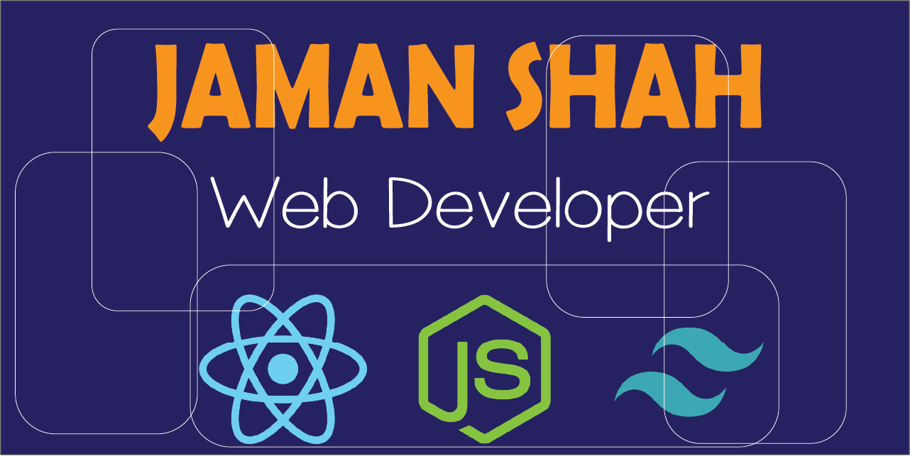

## ABOUT ME

## 👋 Hi, I'm Jaman Shah!

🌟I am a Junior MERN Stack Web Developer with a strong passion for creating dynamic, responsive, and visually stunning web applications. My expertise lies in utilizing MongoDB, Express.js, React, and Node.js to build seamless, high-performance applications.

I am dedicated to crafting interactive user experiences and incorporating eye-catching animations to enhance user engagement and satisfaction. My goal is to continuously improve my skills and contribute to innovative projects that make a meaningful impact.

🚀 I am currently exploring React Native Next Js and new technologies

## :chart_with_upwards_trend: Current Stats

  

 
<h2 align="left"> ⚙ Technologies</h2>
<table align="center">
  <tr>
    <td align="center" width="96">
      
       React
    </td>
    <td align="center" width="96">
      
       NodeJs
    </td>
    <td align="center" width="96">
      
       Express
    </td>
    <td align="center" width="96">
      
       TailWindCSS
    </td>
    <td align="center" width="96">
      
       Firebase Auth 
    </td>
  </tr>
</table>
